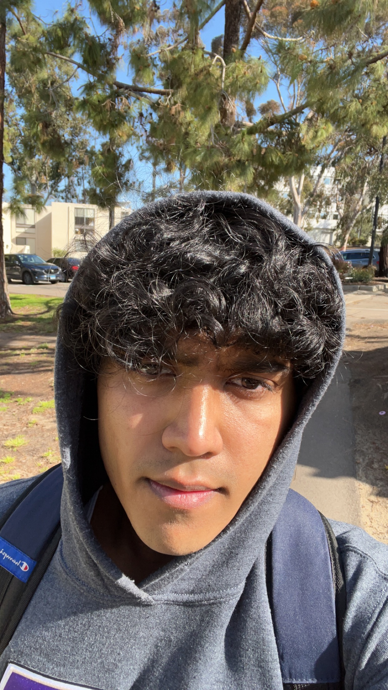

# Welcome to My GitHub Page

Hello my name is *Nilay*.  This is my GitHub Page site

## Contents
- [About Me](#about-me)
- [Projects](#projects)

## Relative link example
[Readme](GithubPagesProj/readme.md)

## About Me
Hi! I am fourth-year undergraduate student at the University of California San Diego majoring in Computer Science and Math. I have plenty of experience with Full Stack Development and Relational Database Management Projects. I am passionate about Robotics and Software engineering disciplines in general.

One my favorite quotes is from Bill Gates: 
>It's fine to celebrate success, but it is more important to heed the lessons of failure

## Projects

- **Project C:** 
Contact tracing Application
May 2021 - Jun 2021
Developed a mock COVID-19 Contact Tracing Application as a self-directed project using Java and Derby relational database. The application allows users to enter linked details of all the people they encountered and shows a hierarchical and relational tree diagram giving an overview of the potential infection spread amongst people.

## Skills
- Java
- Python

## IDEs
1. vscode
2. netbeans

## Task
- [] Create project 2
- [x] Create project 1

## Contact info
My email is [Email](mailto:bhootnilay@gmail.com) 
My LinkedIn is [LinkedIn](https://www.linkedin.com/in/nilay-bhoot-6845b41b2/).

## Extra
[Help](https://docs.github.com/en/pages)

